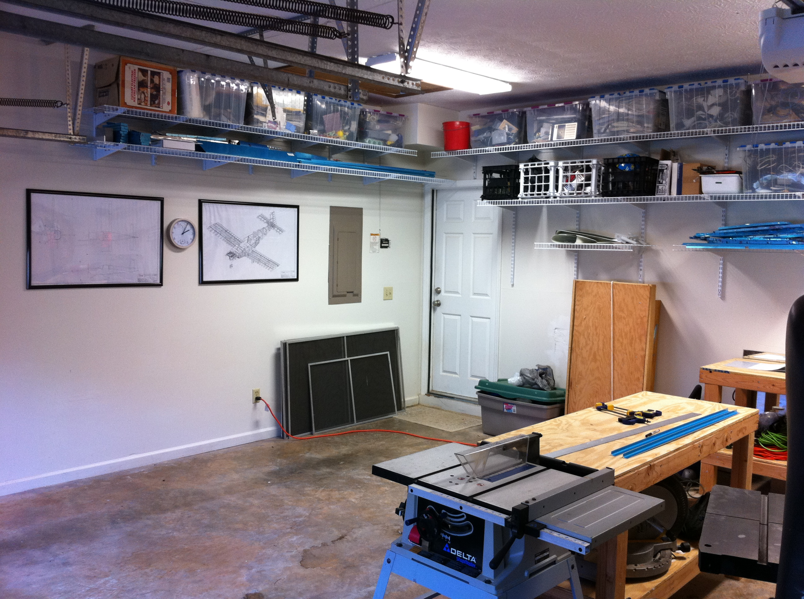
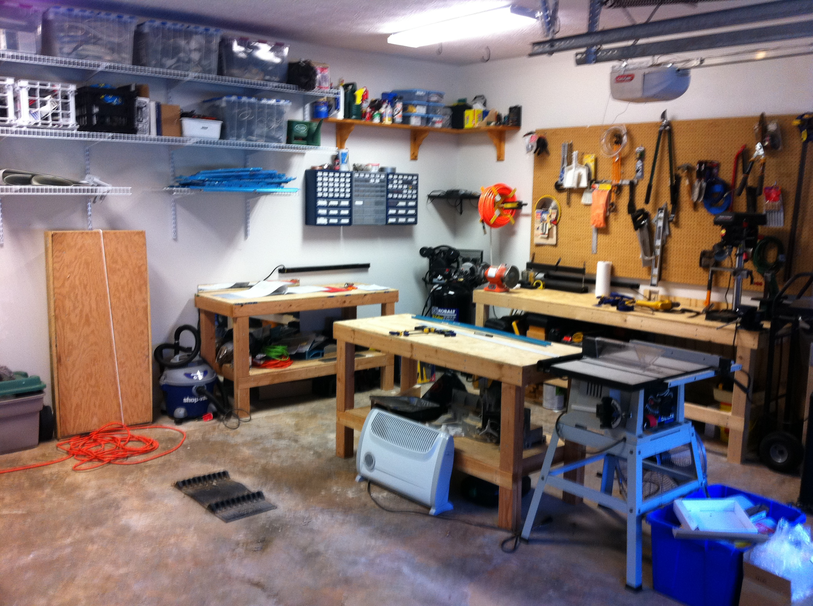
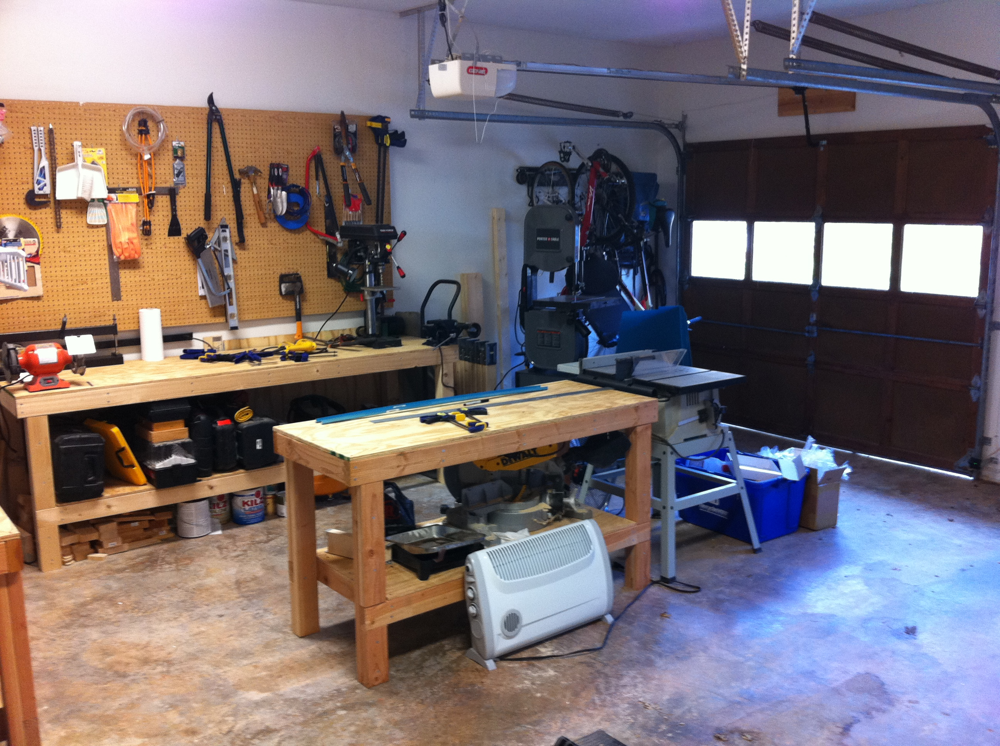
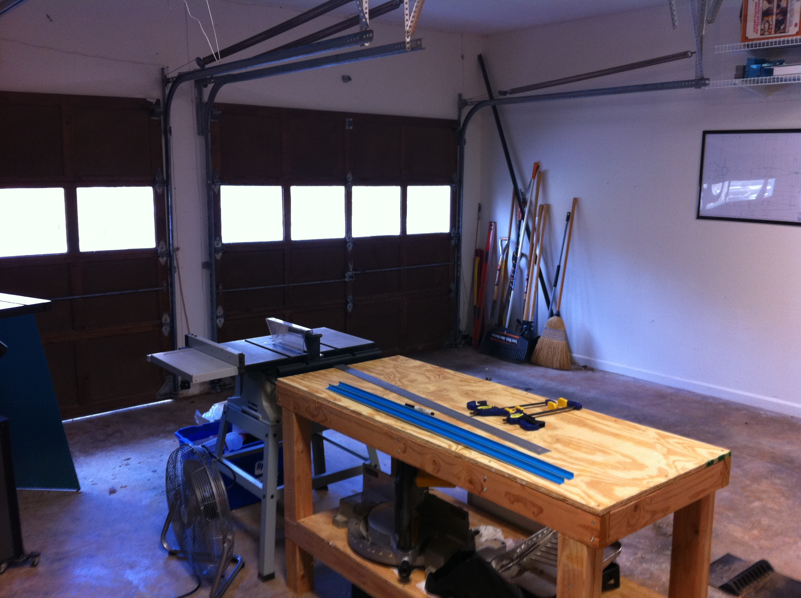
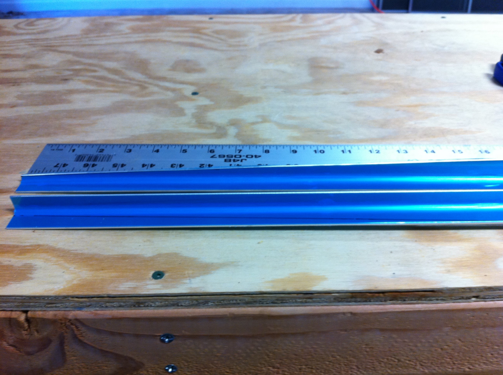
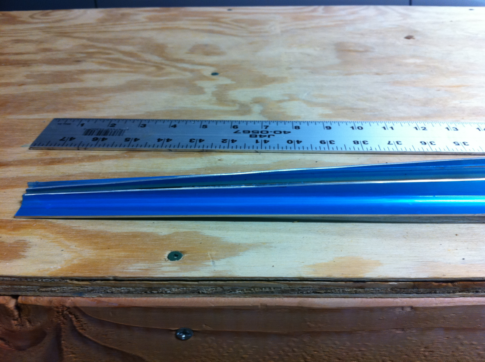
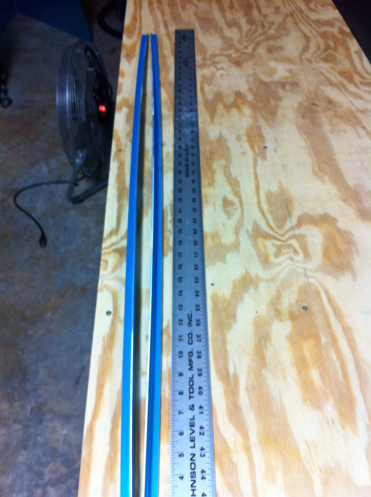
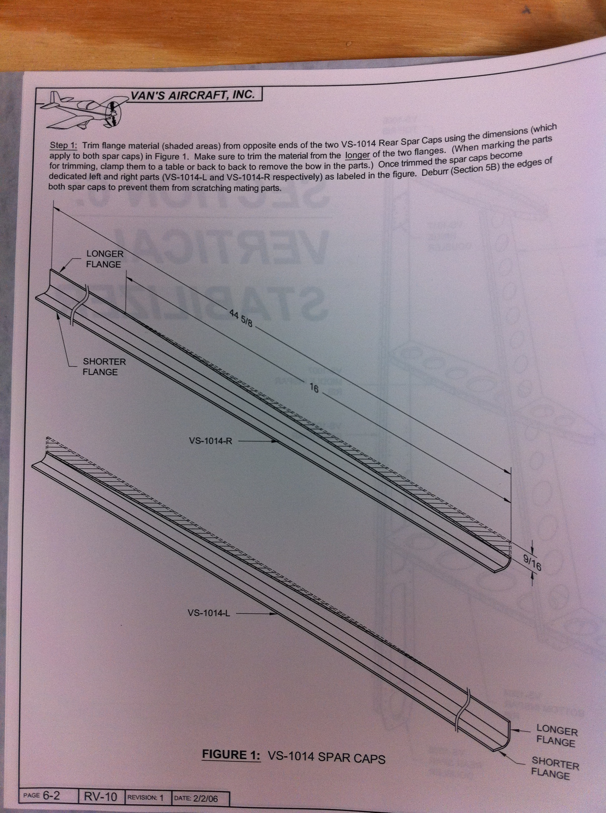
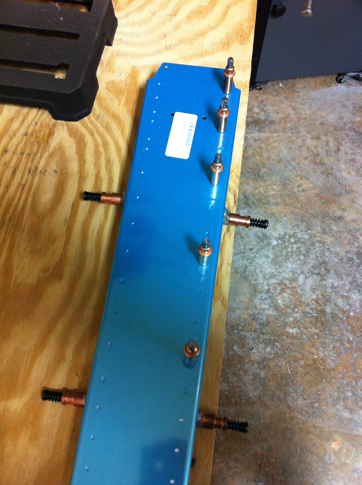
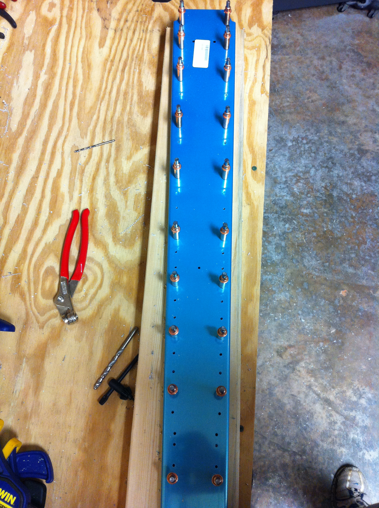

# Step 1 Complete

<table style="border:0">
  <tr>
    <td>Hours: 0.5</td>
  </tr>
  <tr>
    <td>Manual Ref: Page 6-2, Step 1</td>
  </tr>
  <tr>
    <td>Partner: N/A</td>
  </tr>
</table>

It official, I've now started on my RV-10!  Step 1 is complete.

<table style="border:0">
  <tr>
    <td>Hours: 2.0</td>
  </tr>
  <tr>
    <td>Manual Ref: Page 6-2, Step 2</td>
  </tr>
  <tr>
    <td>Partner: N/A</td>
  </tr>
</table>

Later on in the day, after visiting the airport of course, I went ahead and finished step 2 :) Thankfully I've done a 
good deal of practice on the toolbox and "class project", and drilling/deburring have become second nature.

