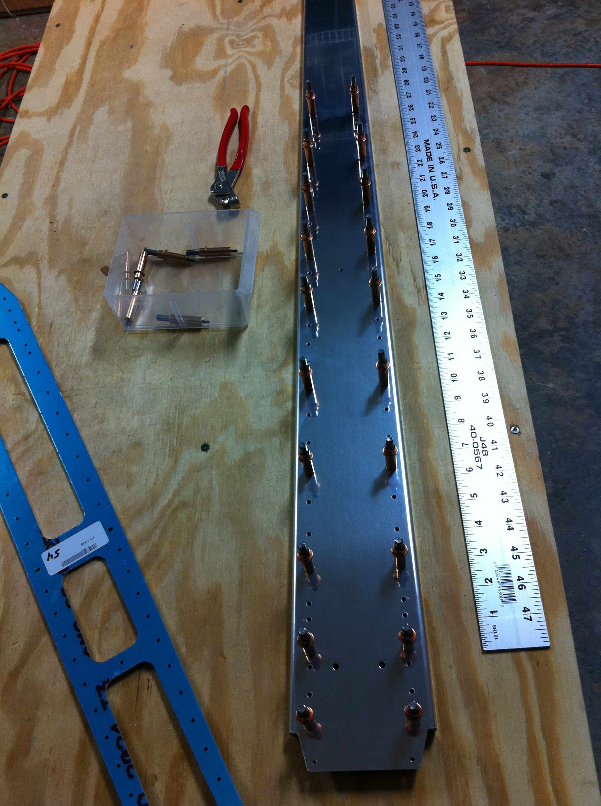
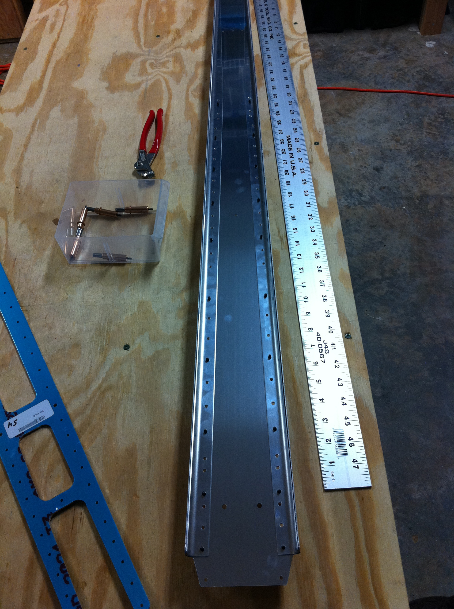
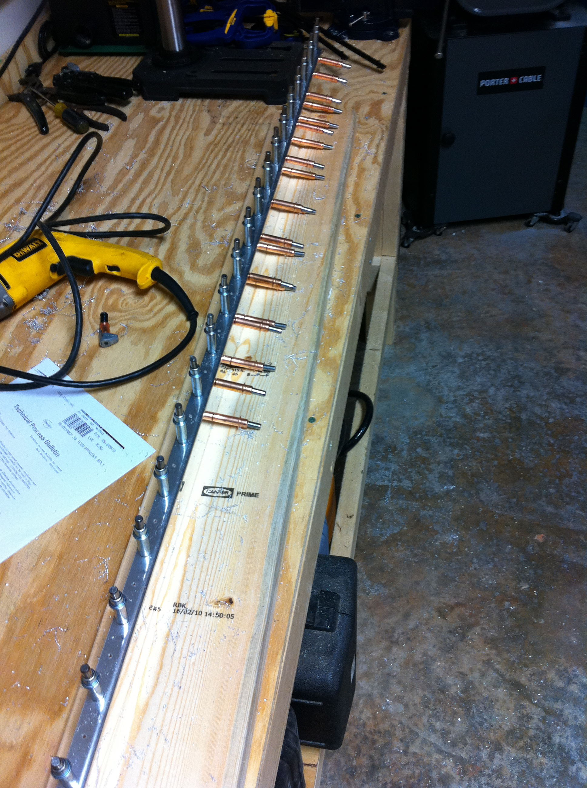
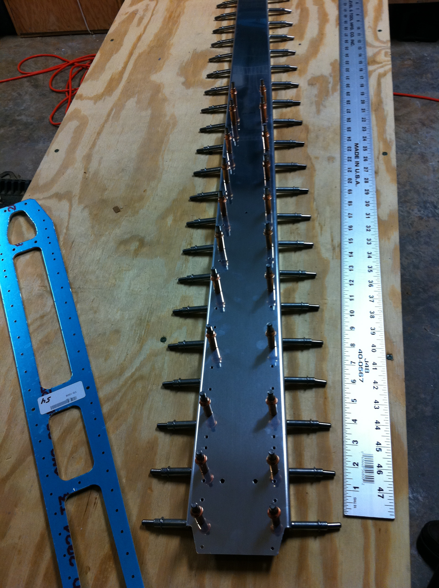
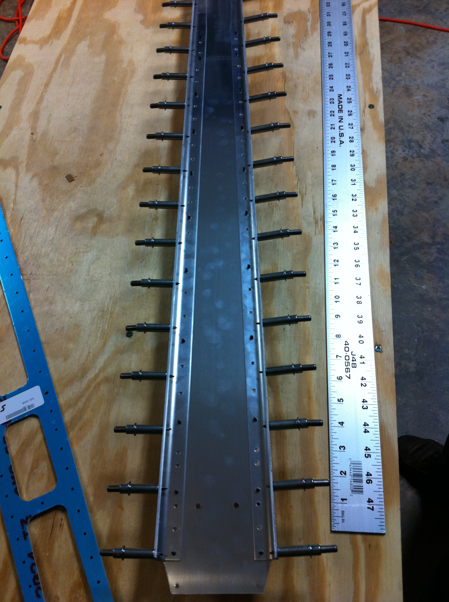

# Vertical Stabilizer – Step 3

<table style="border:0">
  <tr>
    <td>Hours: 4.0</td>
  </tr>
  <tr>
    <td>Manual Ref: Page 6-2, Step 2 &amp; 3</td>
  </tr>
  <tr>
    <td>Partner: N/A</td>
  </tr>
  <tr>
    <td>Notes: 12/6/2010 5-7 step 3, page 6-2</td>
  </tr>
</table>

Lots of holes to be drilled then cleco'ed then deburred!  So far, no issues.  I'm probably taking more time than 
is absolutely necessary, but I want to keep things at "no issues".

