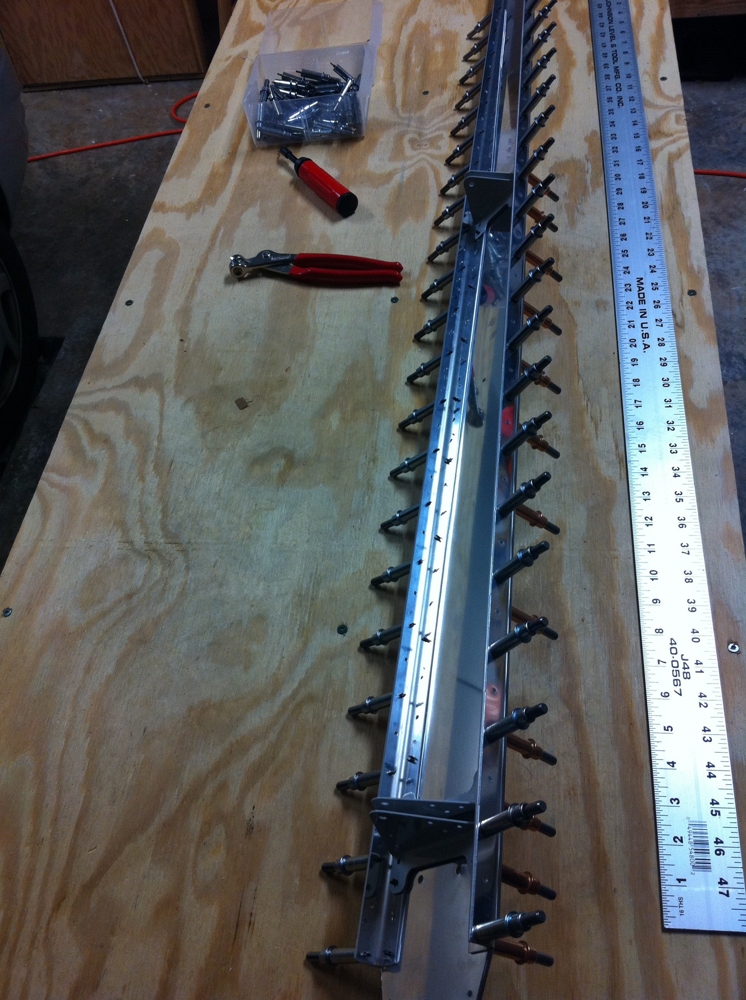
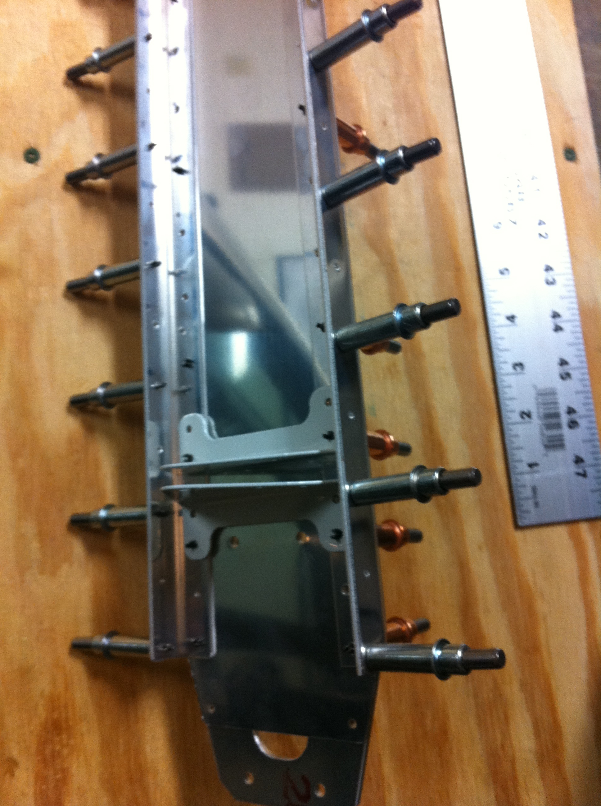
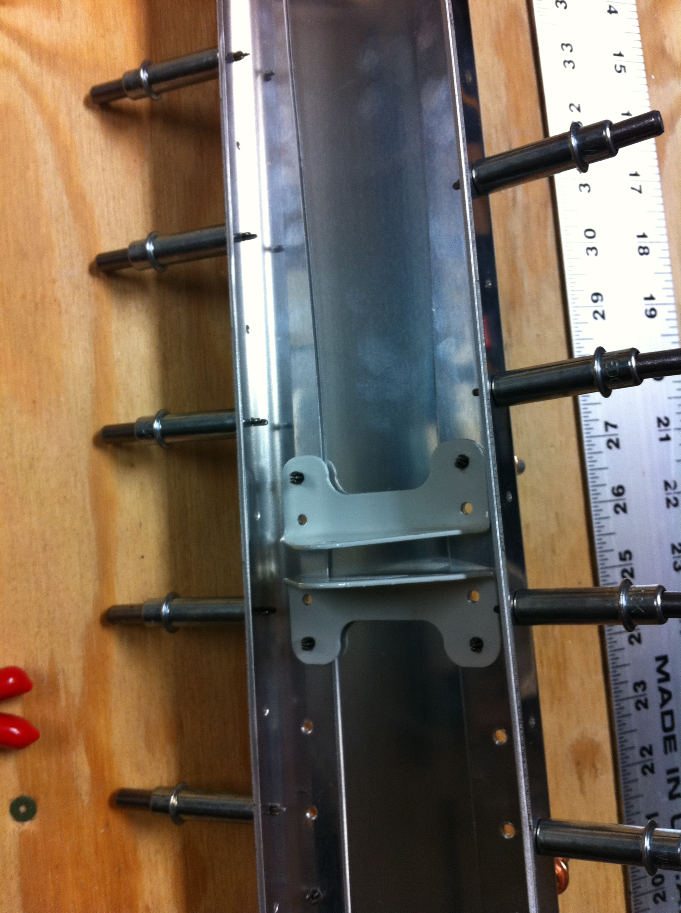
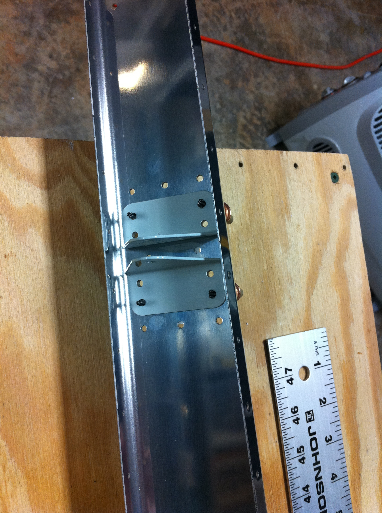
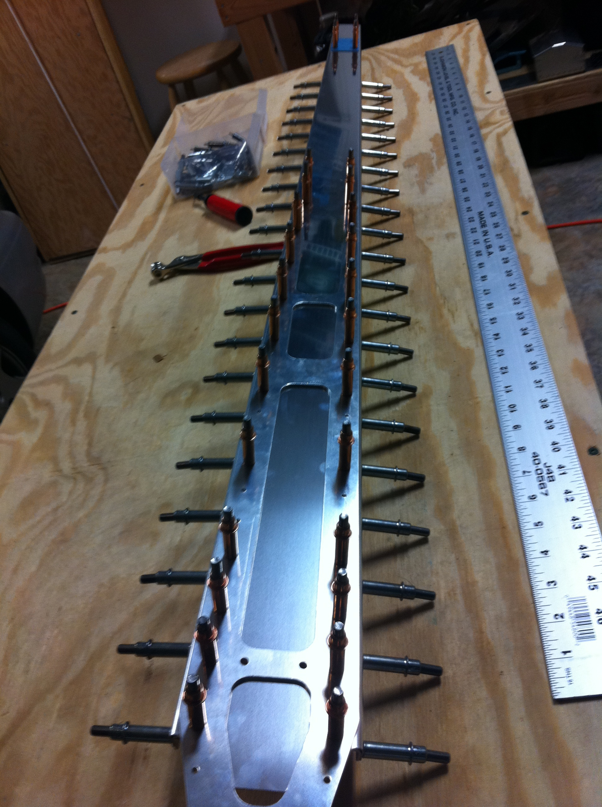
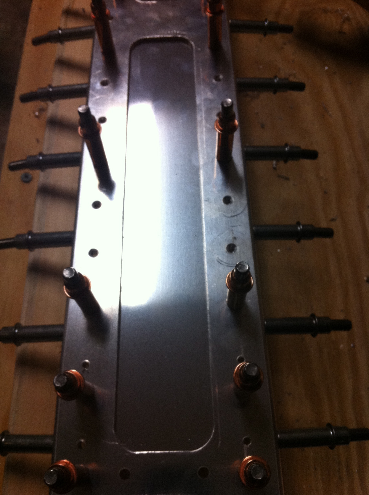
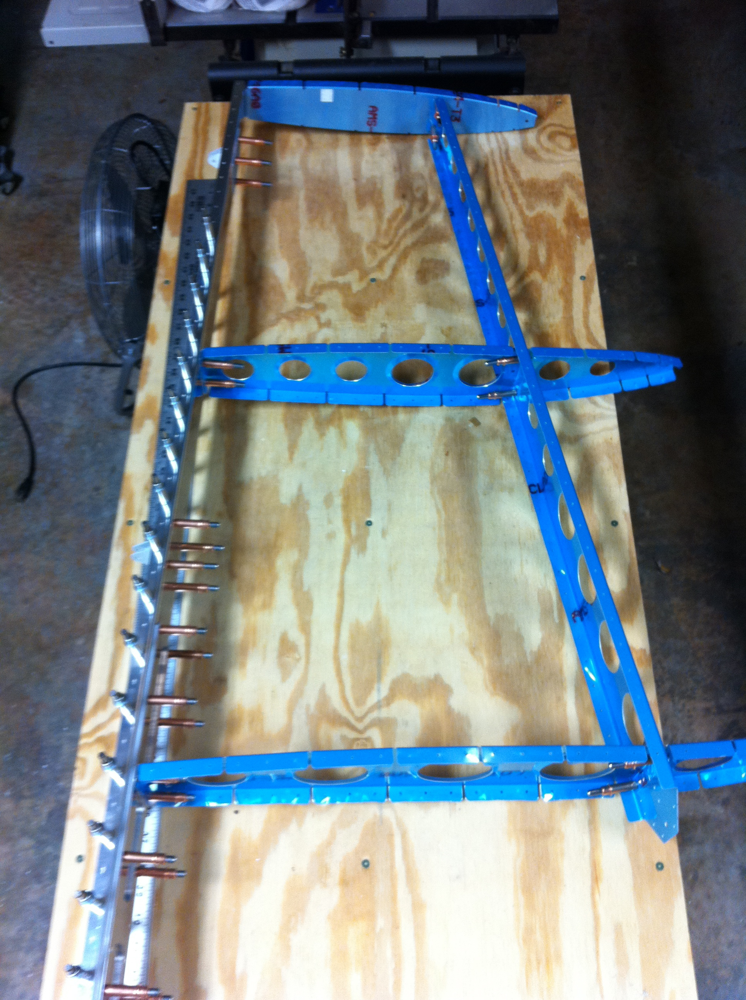
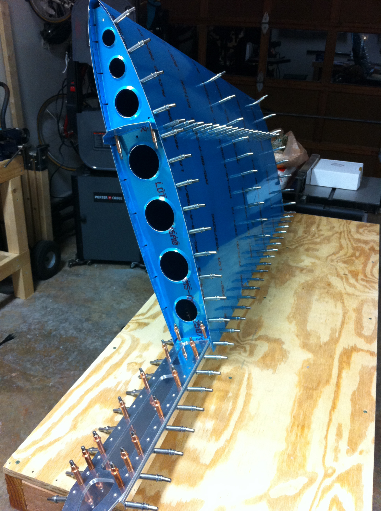
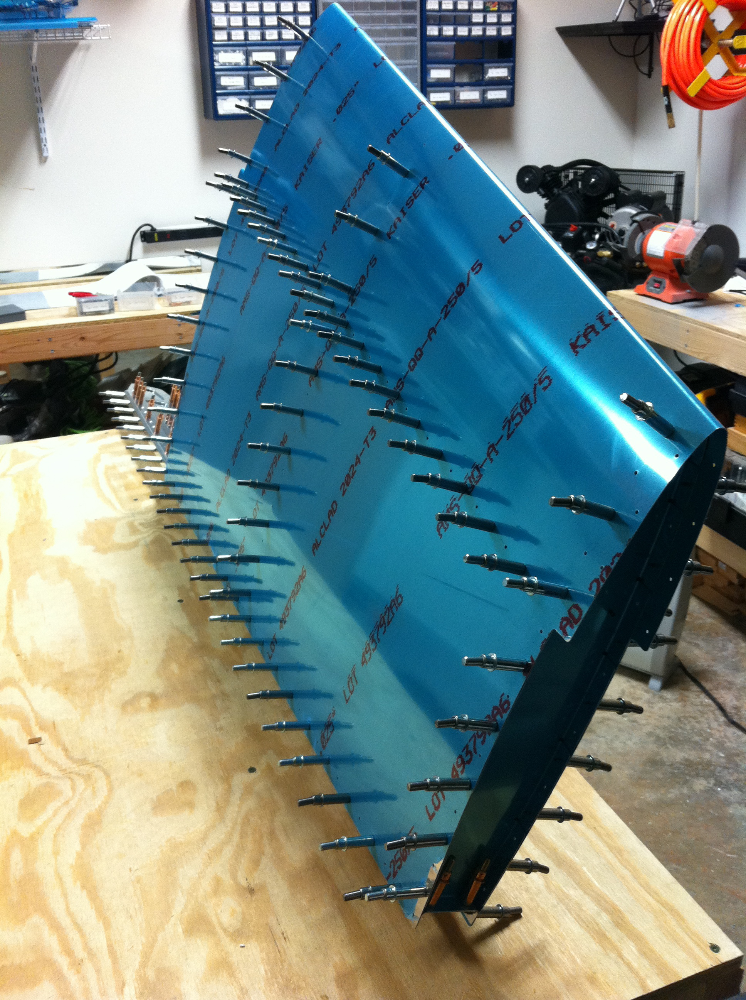
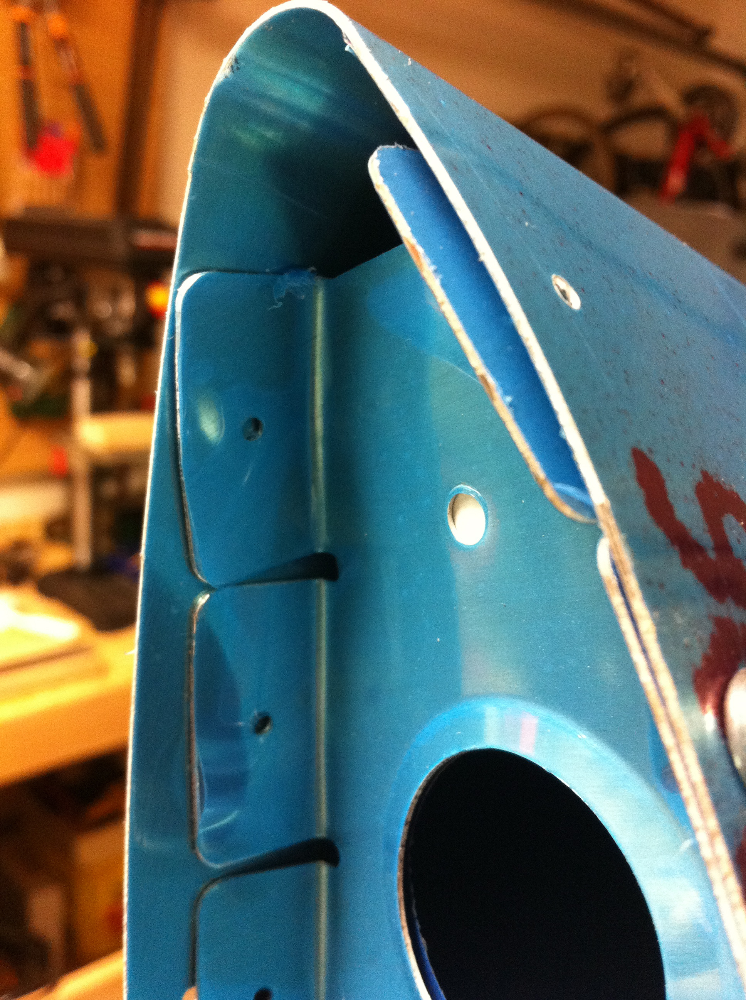

# Vertical Stabilizer Test Fit #1

<table style="border:0">
  <tr>
    <td>Hours: 3.5</td>
  </tr>
  <tr>
    <td>Manual Ref: Page 6-2, Steps 4, 5, and 6</td>
  </tr>
  <tr>
    <td>Partner: N/A</td>
  </tr>
</table>

It didn't take long to get the holes final drilled and get all the pieces cleco'ed together.  I haven't yet deburred 
all the parts, but wanted to see what <a href="http://www.myrv10.com/tips/gotchas.html">Tim Olson</a> had said about 
the ribs needing a little bit shaved off or they will cause a bend in the skin (see last picture below).  Now to 
take it all apart and start on step #7, deburring all those parts!  For a time-lapse video of the assembly process, 
see <a href="RV-10-VerticalStabilizer.mov">vertical stabilizer assembly</a>

