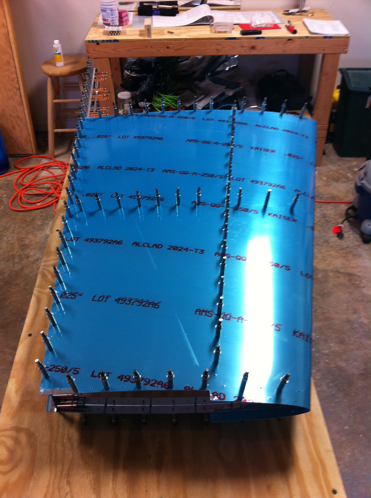
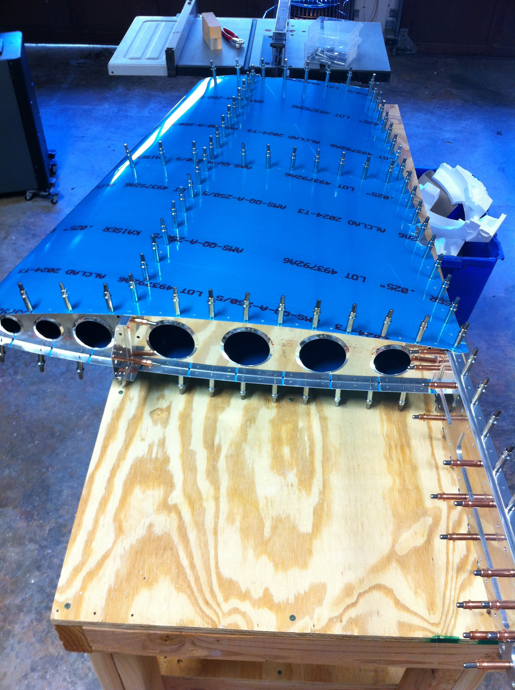
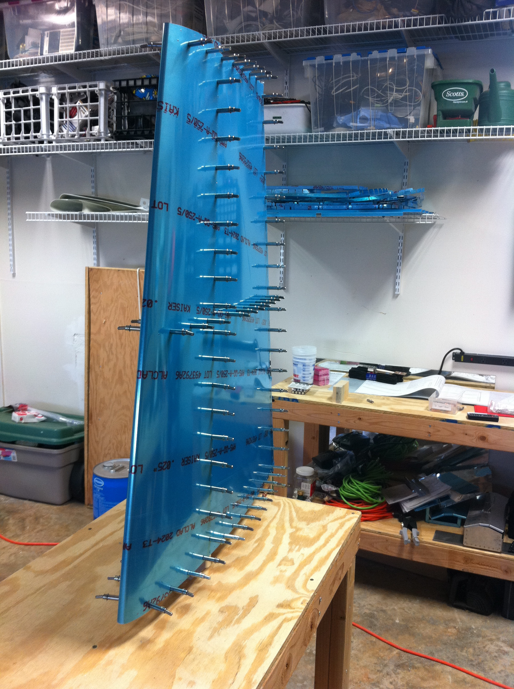
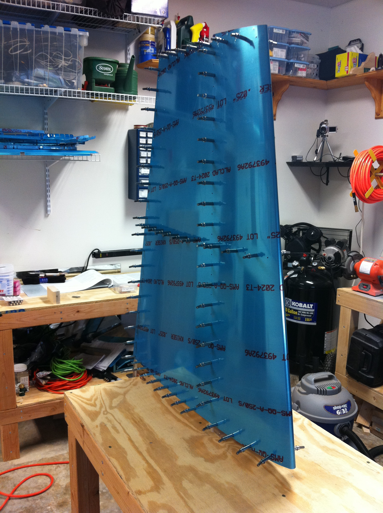
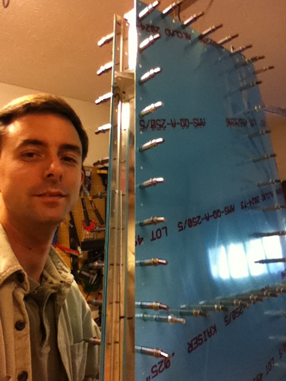
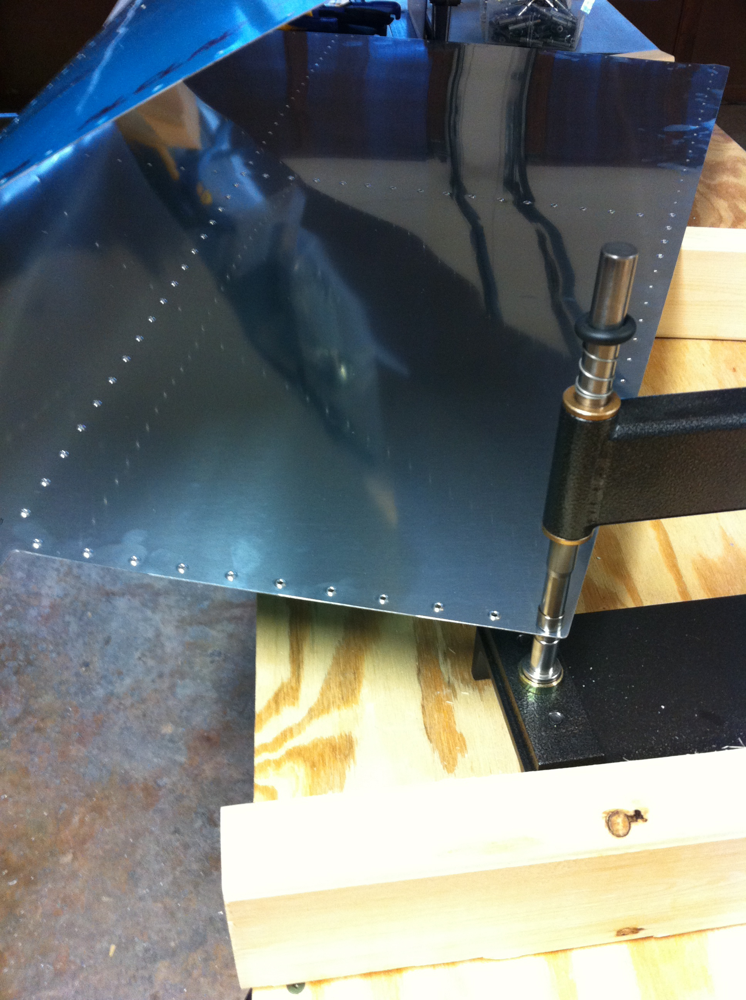

# Vertical Stabilizer Test Fit #2

<table style="border:0">
  <tr>
    <td>Hours: 5.0</td>
  </tr>
  <tr>
    <td>Manual Ref: Page 6-3 and 6-4</td>
  </tr>
  <tr>
    <td>Partner: N/A</td>
  </tr>
  <tr>
    <td>Notes: 9-10:30 step 1, page 6-3</td>
  </tr>
</table>

After a little trimming of the ribs, the skin fit much better.  Taking off the vinyl from the inside of the vertical 
stabilizer skin was tougher than I thought it would be.  That stuff can be quite tough in large amounts. 
  Dimpling was also quite a lengthy process.  The C-Frame is quite nice, but getting it in close to the front of 
the skin (where the bend is) just wasn't going to happen.  So, I've ordered a set of dimple dies from Aircraft 
Spruce that can be used with a pull riveter to handle those.

