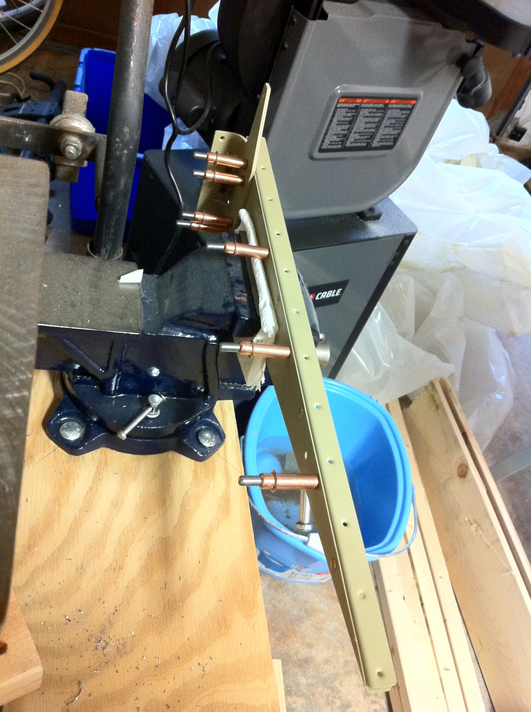
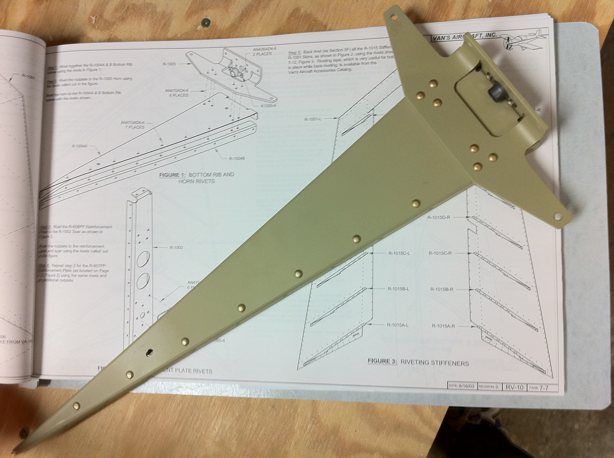
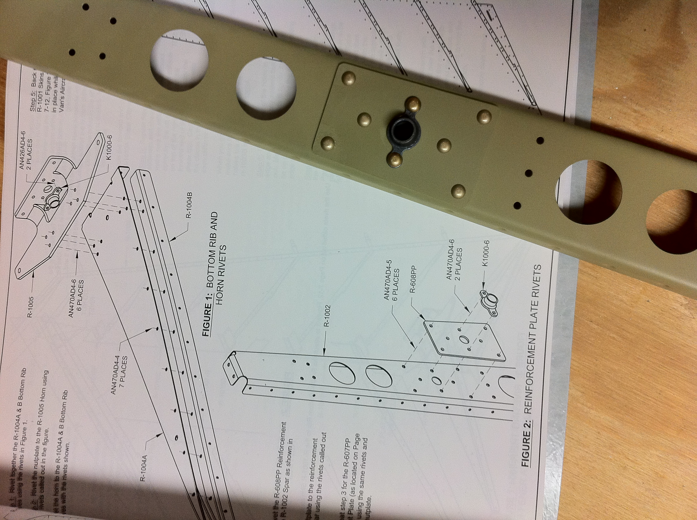
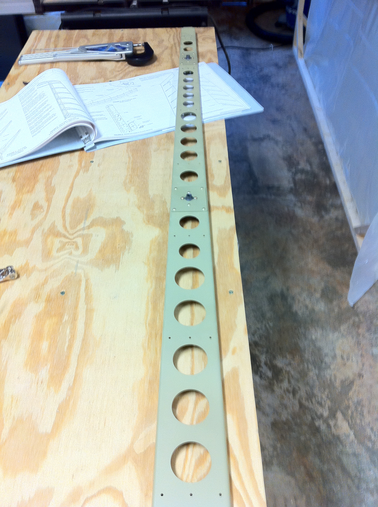

# Rudder riveting

<table style="border:0">
  <tr>
    <td>Hours: 2.0</td>
  </tr>
  <tr>
    <td>Manual Ref: Page 7-7, Steps 1 through 4</td>
  </tr>
  <tr>
    <td>Partner: N/A</td>
  </tr>
</table>

After the EAA690 breakfast, I tried my hand at driving a few more rivets.  My arms are still tired from yesterday :-(  
I did manage to make some progress.  I haven't yet primed the rudder skins, which I plan on doing when I prime the 
first few parts of the horizontal stabilizer.  That should be coming up pretty soon.

