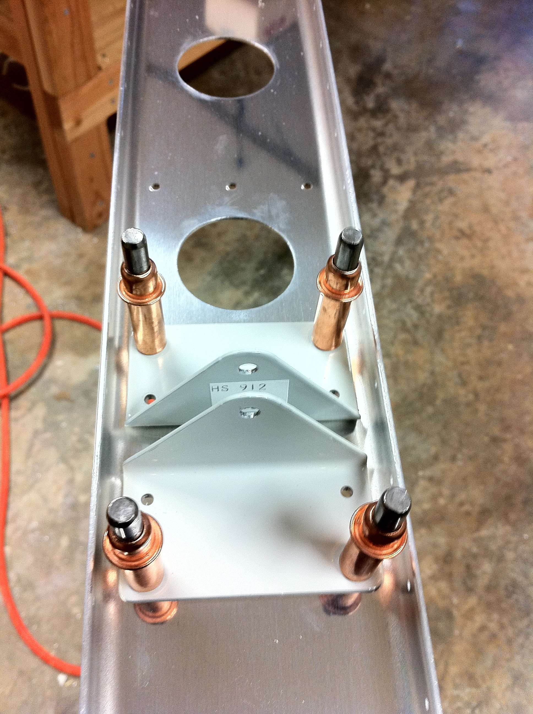
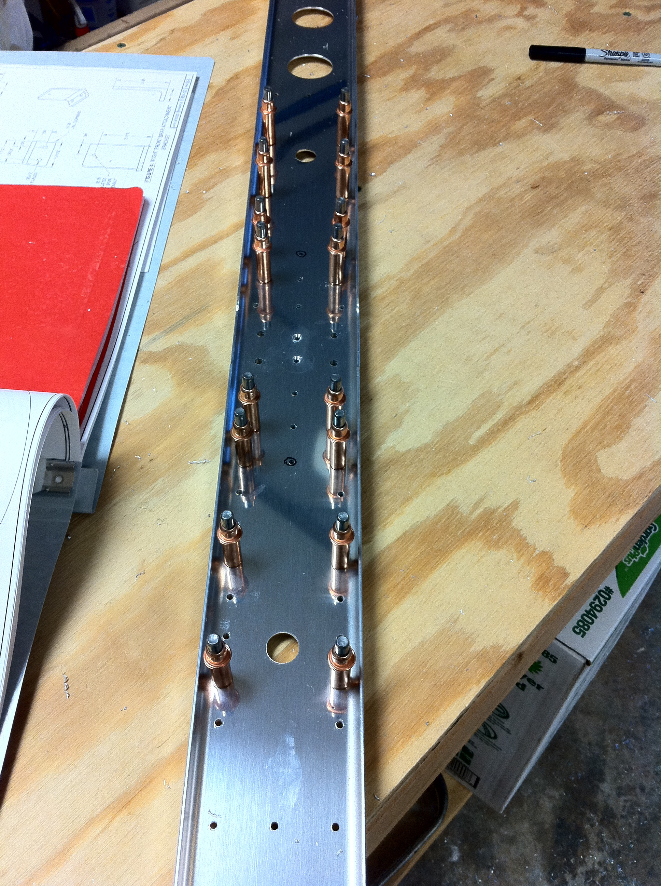
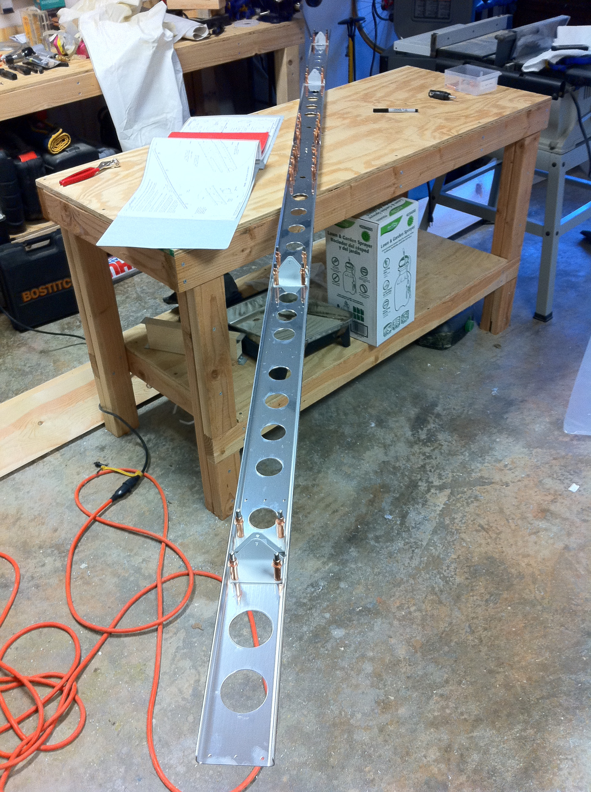
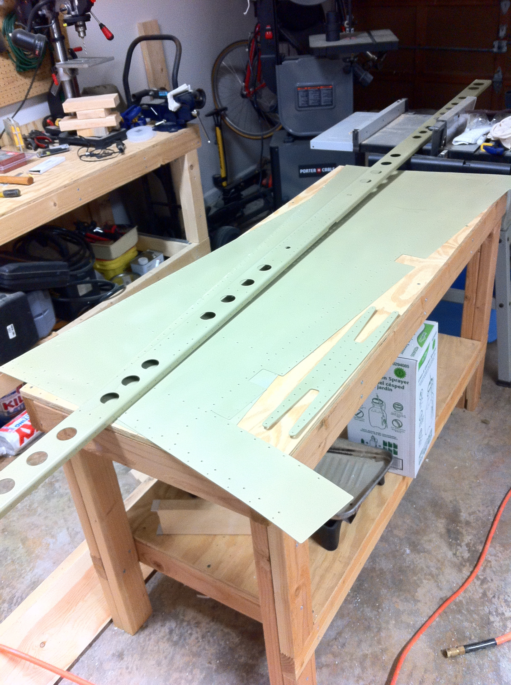

# Horizontal Stabilizer Deburring and Priming

<table style="border:0">
  <tr>
    <td>Hours: 6.0</td>
  </tr>
  <tr>
    <td>Manual Ref: Page 8-2, Steps 1 through 4</td>
  </tr>
  <tr>
    <td>Partner: N/A</td>
  </tr>
</table>

I decided to tackle the rear horizontal stabilizer spar before the next round of priming, just so I didn't have to get 
all suited up more times than I absolutely had to.  I do not like the priming process!  On a more positive note, a 
simple file does wonders for deburring spars :-)  I also created another 
<a href="HorizontalStabilizerRearSpar.mov">time-lapse video</a> of the deburring process, and yes, I did do this 
after church ;-)

