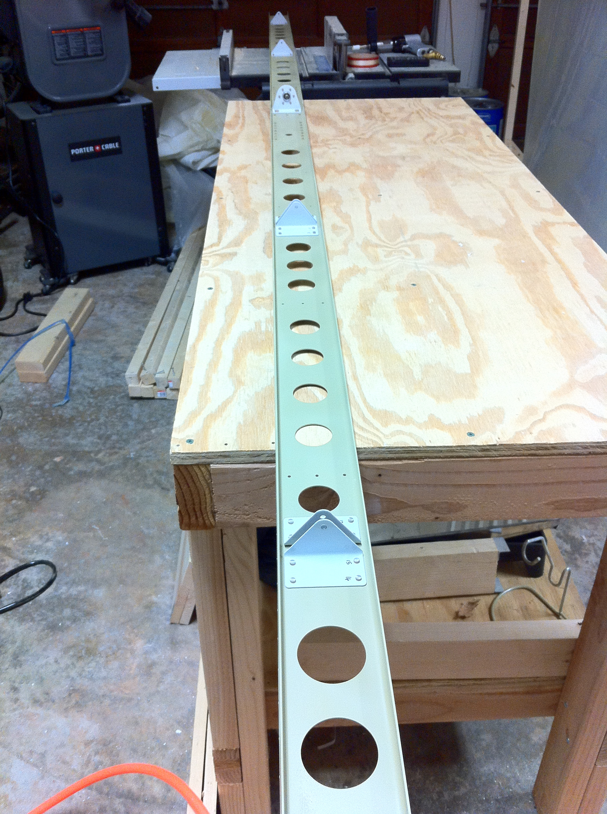
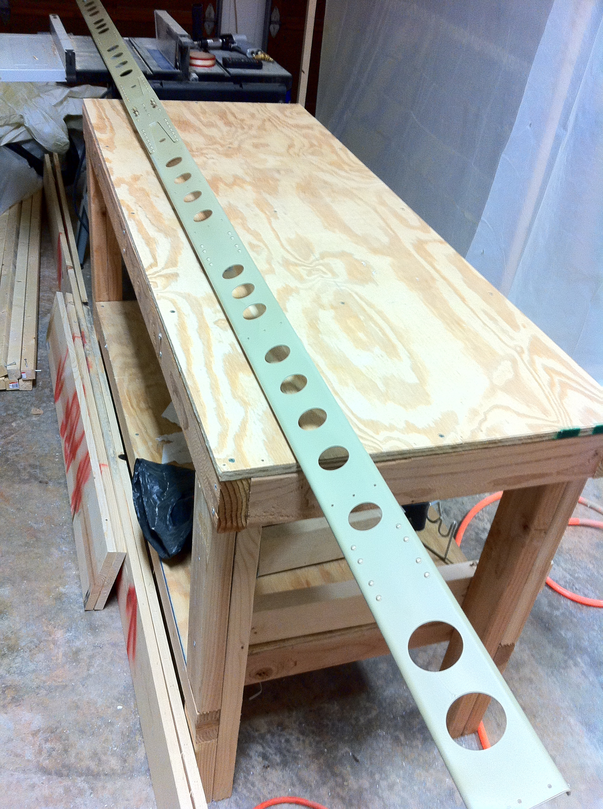

# Rudder and HS Spar Riveting

<table style="border:0">
  <tr>
    <td>Hours: 8.0</td>
  </tr>
  <tr>
    <td>Manual Ref: Page 7-8, Steps 1, 2 and 3; Page 7-9 Step 1; Page 8-2, Steps 1 through 6; Page 8-3, Steps 1 and 2</td>
  </tr>
  <tr>
    <td>Partner: N/A</td>
  </tr>
</table>

Here is another <a href="RudderSkinRiveting.mov">time-lapse video</a> of me back-riveting the rudder stiffeners onto 
the rudder skins.  I managed to make some more progress on the horizontal stabilizer rear spar.  Hopefully I'll be 
making a lot more progress over the weekend.

