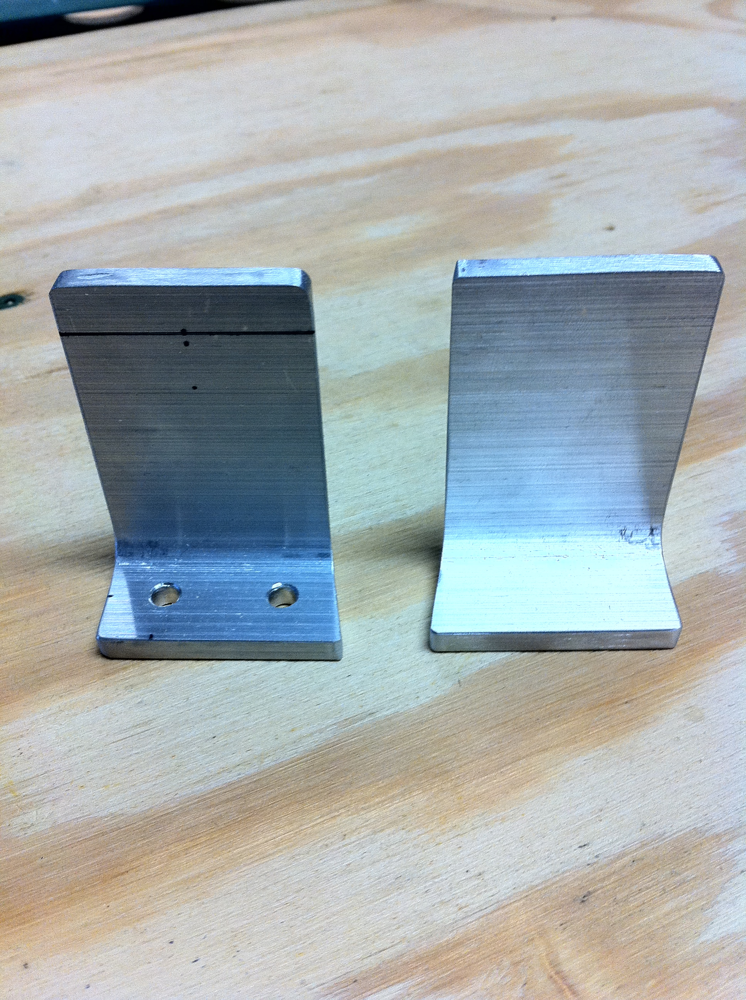
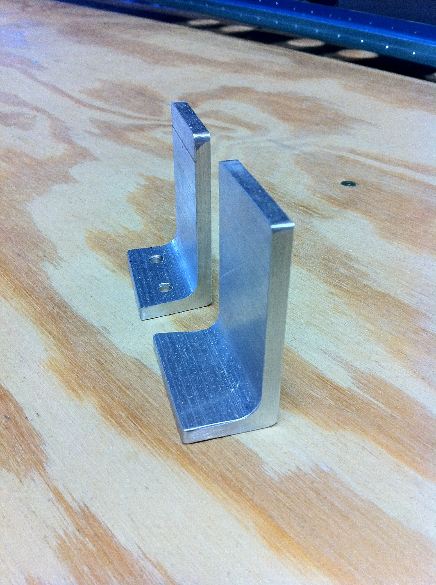
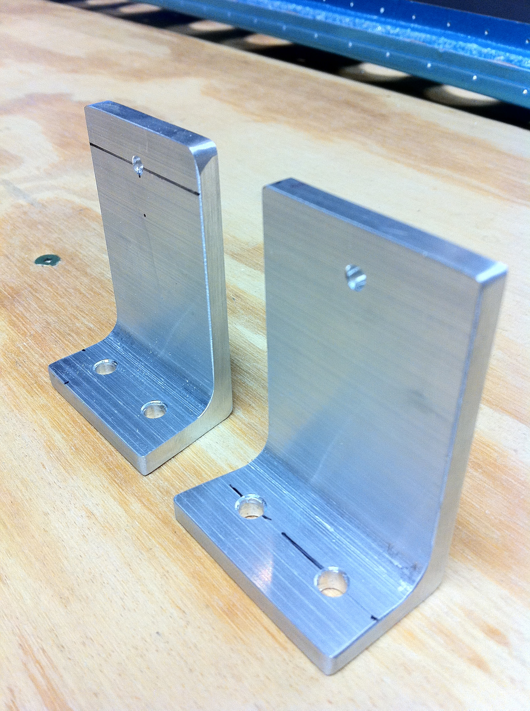
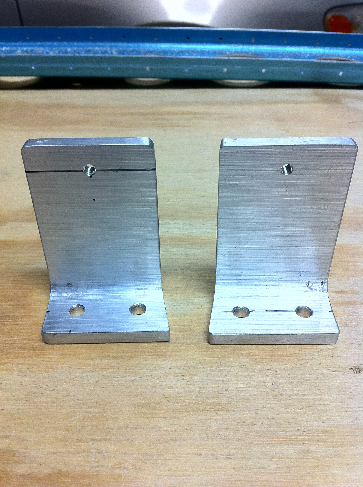

# Right Front Spar Attachment

<table style="border:0">
  <tr>
    <td>Hours: 2.0</td>
  </tr>
  <tr>
    <td>Manual Ref: Page 8-3, Step 3 &amp; 4</td>
  </tr>
  <tr>
    <td>Partner: N/A</td>
  </tr>
</table>

In between other things, I managed to knock out the left and right front spar attachments.  That band saw purchase was 
definitely worth it!

