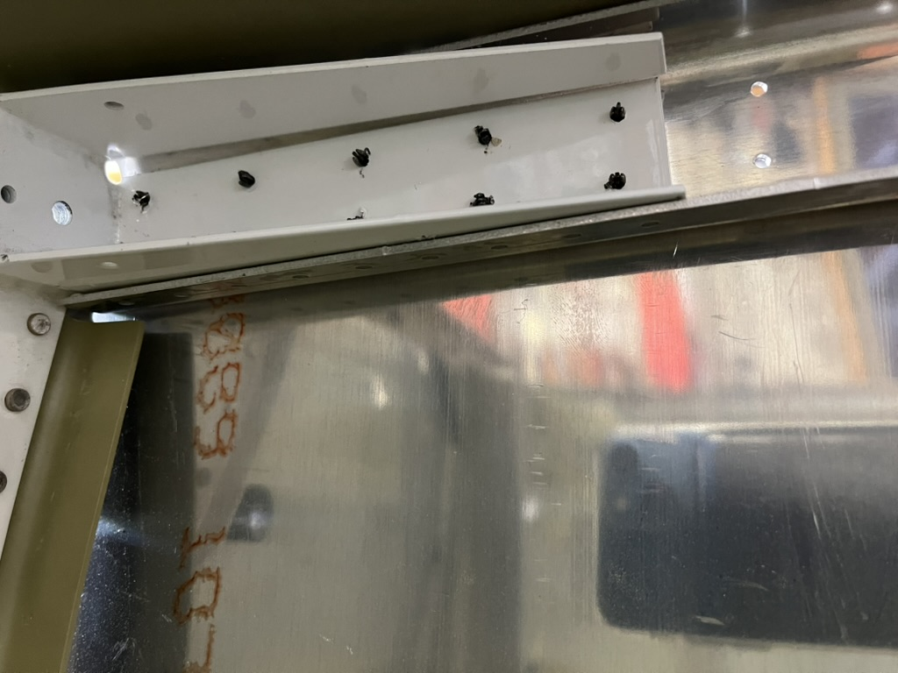
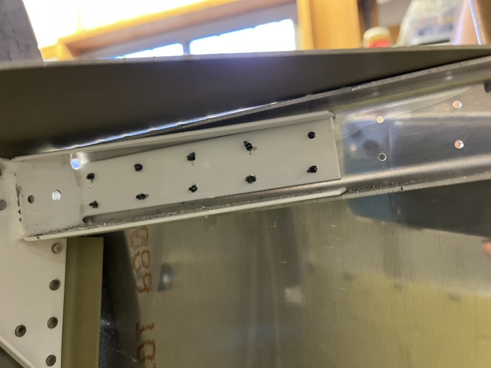
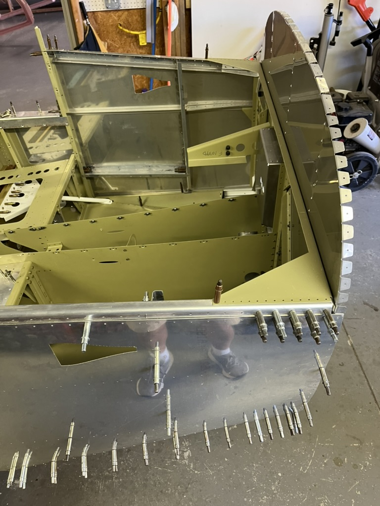
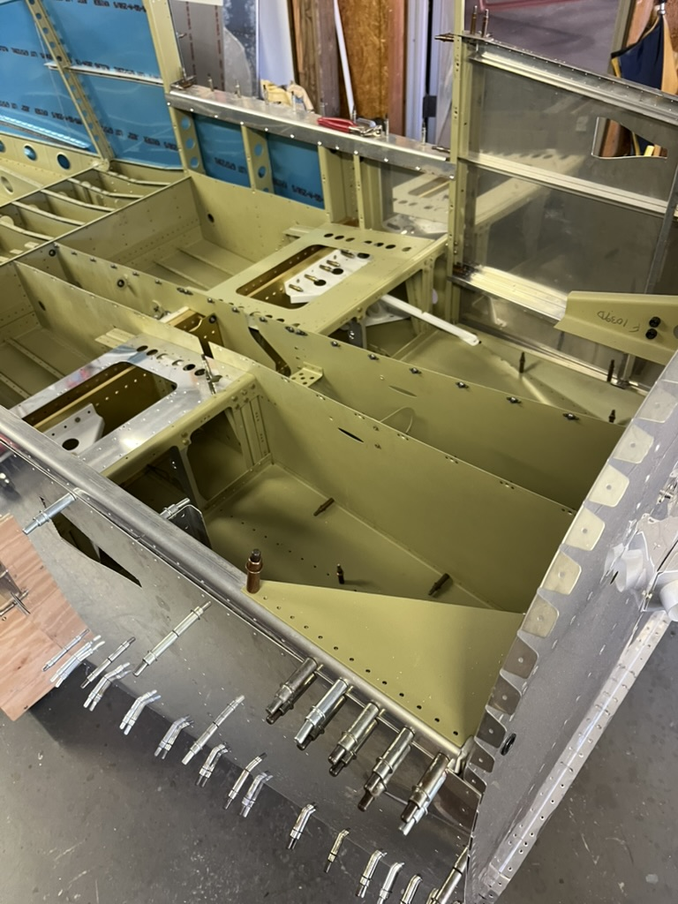
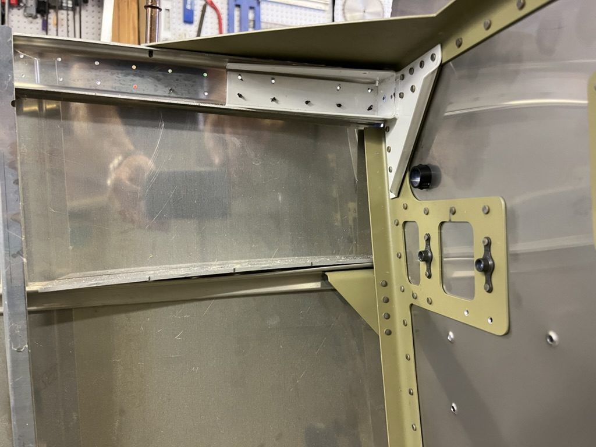
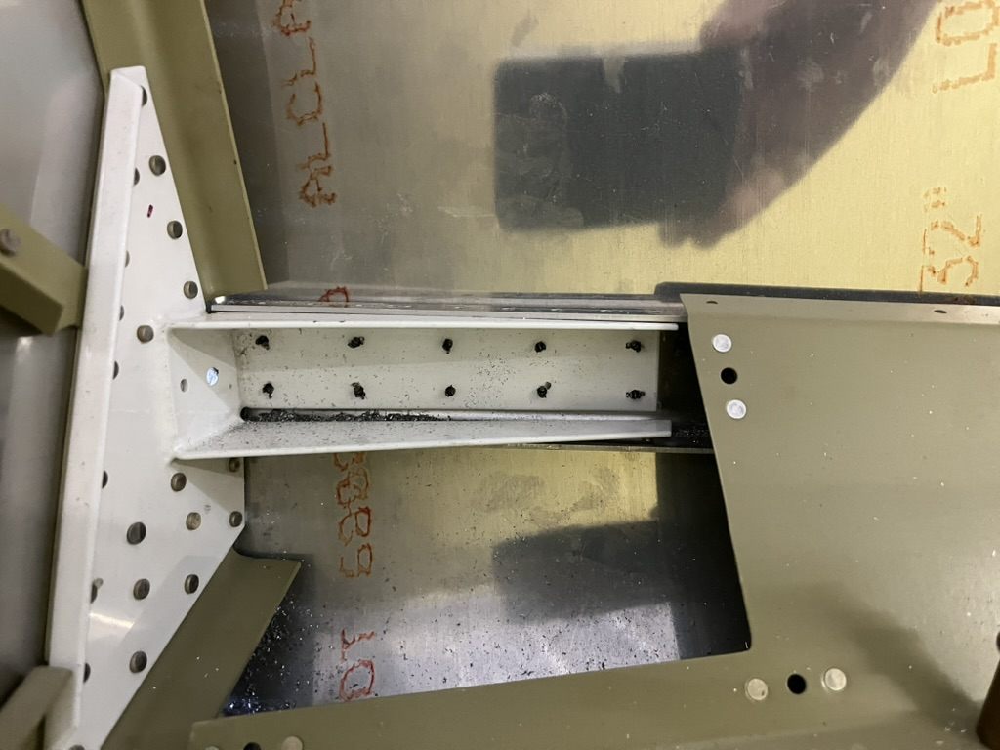
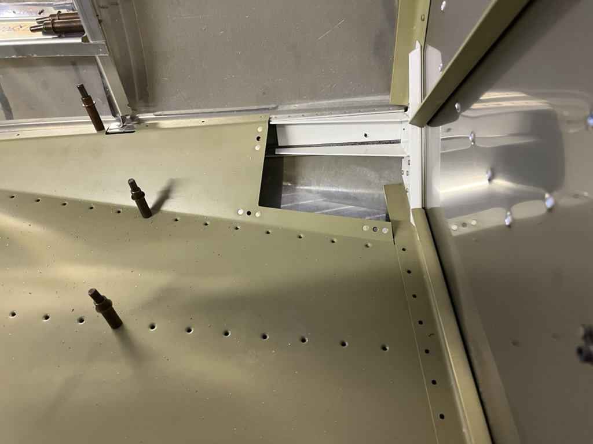

# Match and Final Drilling the Forward Fuselage Side Skins

<table style="border:0">
  <tr>
    <td>Hours: 3</td>
  </tr>
  <tr>
    <td>Manual Ref: Page 29-13 steps 1, 2 and 1/2 of step #3</td>
  </tr>
  <tr>
    <td>Partner: N/A</td>
  </tr>
</table>

I'm slowly getting back into building on the project.  Most of the weekend was spent going over safety procedures with 
the local police and fire departments, but I was able to spend a few hours getting back into the building process.  The 
hardest part has been trying to figure out where I left off.  A testament to keeping a build log!

