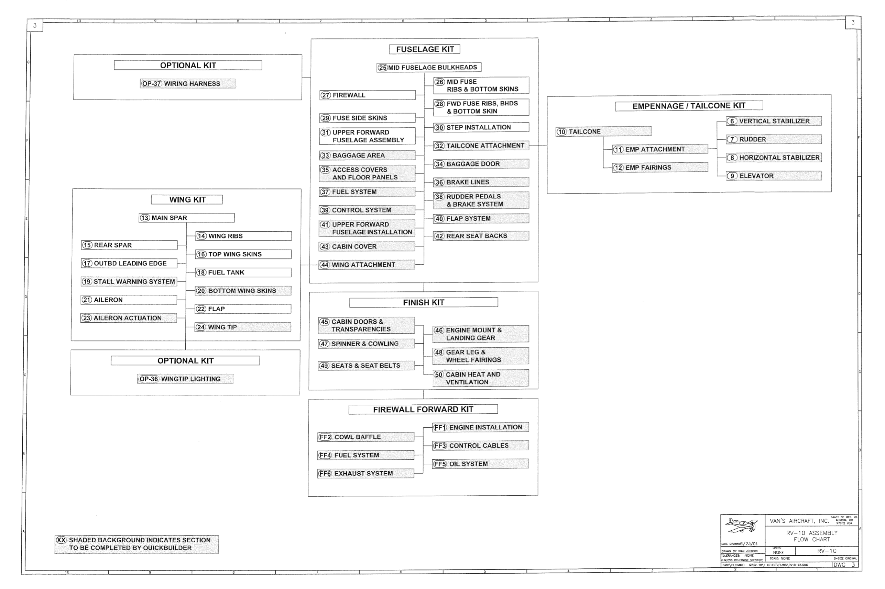

# N42BM Build Log

  
  

<map id="imgmap202552394737" name="imgmap202552394737">
<area shape="rect" alt="Verticle Stabilizer" title="" coords="2112,338,2392,366" href="section6.html" target="_self" />
<area shape="rect" alt="Rudder" title="" coords="2114,392,2390,418" href="section7.html" target="_self" />
<area shape="rect" alt="Horizontal Stabilizer" title="" coords="2114,442,2390,472" href="section8.html" target="_self" />
<area shape="rect" alt="Elevator" title="" coords="2112,496,2392,524" href="section9.html" target="_self" />
<area shape="rect" alt="Emp Attachment" title="" coords="1782,420,2058,446" href="section11.html" target="_self" />
<area shape="rect" alt="Emp Fairings" title="" coords="1784,476,2064,498" href="section12.html" target="_self" />
<area shape="rect" alt="Tailcone" title="" coords="1616,370,1898,398" href="section10.html" target="_self" />
<area shape="rect" alt="Mid Fuselage Bulkheads" title="" coords="1096,180,1402,212" href="section25.html" target="_self" />
<area shape="rect" alt="Mid Fuse Ribs & Bottom Skins" title="" coords="1262,222,1542,276" href="section26.html" target="_self" />
<area shape="rect" alt="Fwd Fuse Ribs, BHDS, & Bottom Skin" title="" coords="1262,290,1540,336" href="section28.html" target="_self" />
<area shape="rect" alt="Step Installation" title="" coords="1260,356,1540,386" href="section30.html" target="_self" />
<area shape="rect" alt="Tailcone Attachment" title="" coords="1262,408,1538,438" href="section32.html" target="_self" />
<area shape="rect" alt="Baggage Door" title="" coords="1262,462,1542,492" href="section34.html" target="_self" />
<area shape="rect" alt="Brake Lines" title="" coords="1262,518,1540,546" href="section36.html" target="_self" />
<area shape="rect" alt="Rudder Pedals & Brake System" title="" coords="1260,560,1540,608" href="section38.html" target="_self" />
<area shape="rect" alt="Flap System" title="" coords="1260,624,1542,652" href="section40.html" target="_self" />
<area shape="rect" alt="Rear Seat Backs" title="" coords="1258,674,1540,704" href="section42.html" target="_self" />
<area shape="rect" alt="Firewall" title="" coords="932,262,1210,294" href="section27.html" target="_self" />
<area shape="rect" alt="Fuse Side Skins" title="" coords="930,332,1210,358" href="section29.html" target="_self" />
<area shape="rect" alt="Uppser Forward Fuselage Assembly" title="" coords="932,372,1208,420" href="section31.html" target="_self" />
<area shape="rect" alt="Baggage Area" title="" coords="930,440,1210,466" href="section33.html" target="_self" />
<area shape="rect" alt="Access Covers and Floor Panels" title="" coords="928,480,1210,530" href="section35.html" target="_self" />
<area shape="rect" alt="Fuel System" title="" coords="928,544,1210,574" href="section37.html" target="_self" />
<area shape="rect" alt="Control System" title="" coords="928,598,1210,626" href="section39.html" target="_self" />
<area shape="rect" alt="Upper Forward Fuselage Installation" title="" coords="930,640,1206,690" href="section41.html" target="_self" />
<area shape="rect" alt="Cabin Cover" title="" coords="926,702,1208,732" href="section43.html" target="_self" />
<area shape="rect" alt="Wing Attachment" title="" coords="926,758,1206,784" href="section44.html" target="_self" />
<area shape="rect" alt="Wiring Harness" title="" coords="408,224,686,260" href="sectionOP37.html" target="_self" />
<area shape="rect" alt="Main Spar" title="" coords="404,622,684,650" href="section13.html" target="_self" />
<area shape="rect" alt="Rear Spar" title="" coords="238,698,518,730" href="section15.html" target="_self" />
<area shape="rect" alt="Wing Ribs" title="" coords="570,676,852,704" href="section14.html" target="_self" />
<area shape="rect" alt="Top Wing Skins" title="" coords="568,728,852,754" href="section16.html" target="_self" />
<area shape="rect" alt="Outbd Leading Edge" title="" coords="238,754,516,782" href="section17.html" target="_self" />
<area shape="rect" alt="Fuel Tank" title="" coords="568,780,848,810" href="section18.html" target="_self" />
<area shape="rect" alt="Stall Warning System" title="" coords="236,806,516,834" href="section19.html" target="_self" />
<area shape="rect" alt="Bottom Wing Skins" title="" coords="568,832,848,860" href="section20.html" target="_self" />
<area shape="rect" alt="Aileron" title="" coords="234,860,516,886" href="section21.html" target="_self" />
<area shape="rect" alt="Flap" title="" coords="568,884,846,914" href="section22.html" target="_self" />
<area shape="rect" alt="Aileron Actuation" title="" coords="236,912,514,938" href="section23.html" target="_self" />
<area shape="rect" alt="Wing Tip" title="" coords="568,938,850,964" href="section24.html" target="_self" />
<area shape="rect" alt="Wingtip Lighting" title="" coords="398,1090,682,1118" href="sectionOP36.html" target="_self" />
<area shape="rect" alt="Cabin Doors & Transparencies" title="" coords="926,924,1206,970" href="section45.html" target="_self" />
<area shape="rect" alt="Spinner & Cowling" title="" coords="924,988,1208,1016" href="section47.html" target="_self" />
<area shape="rect" alt="Seats & Seat Belts" title="" coords="926,1050,1206,1080" href="section49.html" target="_self" />
<area shape="rect" alt="Engine Mount & Landing Gear" title="" coords="1260,946,1542,1000" href="section46.html" target="_self" />
<area shape="rect" alt="Gear Leg & Wheel Fairings" title="" coords="1258,1010,1538,1060" href="section48.html" target="_self" />
<area shape="rect" alt="Cabin Heat and Ventilation" title="" coords="1262,1076,1540,1126" href="section50.html" target="_self" />
<area shape="rect" alt="Cowl Baffle" title="" coords="922,1258,1208,1284" href="sectionFF2.html" target="_self" />
<area shape="rect" alt="Fuel System" title="" coords="922,1312,1204,1340" href="sectionFF4.html" target="_self" />
<area shape="rect" alt="Exhaust System" title="" coords="922,1364,1206,1394" href="sectionFF6.html" target="_self" />
<area shape="rect" alt="Engine Installation" title="" coords="1258,1228,1538,1260" href="sectionFF1.html" target="_self" />
<area shape="rect" alt="Control Cables" title="" coords="1258,1284,1540,1312" href="sectionFF3.html" target="_self" />
<area shape="rect" alt="Oil System" title="" coords="1258,1338,1540,1364" href="sectionFF5.html" target="_self" />
<!-- Created by Online Image Map Editor (http://www.maschek.hu/imagemap/index) -->
</map>